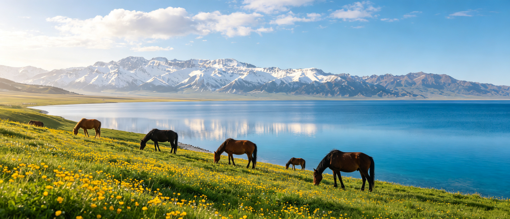

<div align="center" markdown="1">

# 中国旅行指南 · travel-guides

### 稻城亚丁　·　漠河　·　新疆　·　九寨沟　·　香格里拉·梅里　·　额济纳　·　西藏阿里·珠峰

七份亲手整理的交互式旅行攻略，把「什么时候去、怎么走、看什么、要准备什么」讲清楚。

纯 HTML / CSS / JavaScript 单页　·　零依赖　·　零构建　·　浏览器打开即用


</div>

---

## 目的地

### 1. 稻城亚丁

> 蓝色星球上的最后一片净土 · 三神山与三海子的雪域秘境

[](https://ttlook111.github.io/travel-guides/daocheng-yading/)

| 项目 | 说明 |
| :--- | :--- |
| 位置 | 四川甘孜 · 香格里拉镇，国家 5A 级景区 |
| 建议时长 | 景区内 2 天；长线最高点 4700 m · 五色海 |
| 最佳窗口 | 9 月下旬 – 10 月上旬 |
| 攻略涵盖 | 先到香格里拉镇，再分「短线 / 长线」进山；四季景观对比；门票交通、高原反应与装备清单 |

**[在线预览](https://ttlook111.github.io/travel-guides/daocheng-yading/)**　·　**[源码目录](daocheng-yading/)**

---

### 2. 漠河

> 一路向北 · 漠河与大兴安岭

[](https://ttlook111.github.io/travel-guides/mohe-travel/)

| 项目 | 说明 |
| :--- | :--- |
| 位置 | 中国最北 · 大兴安岭北麓，先到哈尔滨再一路向北 |
| 路线 | 3 天 2 晚 · 寻北经典线 |
| 最佳季节 | 首选 9 月中下旬 – 10 月初金秋；12 – 2 月极致冰雪、极光概率相对更高；6 – 8 月避暑与极昼 |
| 攻略涵盖 | 漠河与大兴安岭的关系、交通方式、3 天 2 晚经典线、四季四种模样、最佳月份选择、出发前提醒 |

**[在线预览](https://ttlook111.github.io/travel-guides/mohe-travel/)**　·　**[源码目录](mohe-travel/)**

---

### 3. 新疆

> 新疆不是一个景点，而是一整个大陆的缩影 —— 什么时候去，决定了你能看见什么

[](https://ttlook111.github.io/travel-guides/xinjiang-travel/)

| 项目 | 说明 |
| :--- | :--- |
| 区域格局 | 北疆看风景，南疆看人文 |
| 最佳时间 | 如果只能选一个时间：**9 月**；十二个月对应四种完全不同的新疆 |
| 路线规划 | 第一次去按六步走；三条经典环线，对号入座 |
| 攻略涵盖 | 南北疆差异、十二个月季节历、最佳月份对比、三条经典环线、行前关键提醒 |

**[在线预览](https://ttlook111.github.io/travel-guides/xinjiang-travel/)**　·　**[源码目录](xinjiang-travel/)**

---

### 4. 九寨沟

> 九寨归来不看水 · 一百零八个海子串起的童话世界

[](https://ttlook111.github.io/travel-guides/jiuzhaigou-guide/)

| 项目 | 说明 |
| :--- | :--- |
| 位置 | 四川阿坝藏族羌族自治州 · 九寨沟县，世界自然遗产、国家 5A 级景区 |
| 建议时长 | 3 天 2 晚；沟内 1 日精华，三条主沟呈「Y」字形铺展 |
| 最佳窗口 | **9 月下旬 – 10 月中旬**，10 月 15 日前后一周彩林最盛、海子最蓝 |
| 攻略涵盖 | 三天两晚行程与「先上后下」游览顺序、四季景观对比、门票预约与交通、高反装备与拍照机位 |

**[在线预览](https://ttlook111.github.io/travel-guides/jiuzhaigou-guide/)**　·　**[源码目录](jiuzhaigou-guide/)**

---

### 5. 香格里拉 · 梅里雪山 / 雨崩

> 心中的日月，与雪山深处「不去天堂，就去雨崩」的徒步秘境

[](https://ttlook111.github.io/travel-guides/shangri-la-meili-guide/)

| 项目 | 说明 |
| :--- | :--- |
| 位置 | 云南迪庆 · 香格里拉市至德钦县，卡瓦格博峰 6740 m 为云南第一高峰 |
| 建议时长 | 7 天 6 晚；香格里拉人文湖泊 2–3 天 + 飞来寺金山 + 雨崩徒步 |
| 最佳窗口 | **10 月中旬 – 11 月中旬**，日照金山概率最高、彩林金秋；次选 5 月中下旬杜鹃花海 |
| 攻略涵盖 | 7 天 6 晚行程与海拔适应动线、神瀑 / 冰湖两条徒步线对比、四季与 12 个月适宜度 + 日照金山概率、门票交通、高反与装备贴士 |

**[在线预览](https://ttlook111.github.io/travel-guides/shangri-la-meili-guide/)**　·　**[源码目录](shangri-la-meili-guide/)**

---

### 6. 内蒙古 · 额济纳旗

> 一年只美二十天 · 三千年金色胡杨与大漠童话

[](https://ttlook111.github.io/travel-guides/ejina-guide/)

| 项目 | 说明 |
| :--- | :--- |
| 位置 | 内蒙古阿拉善盟 · 额济纳旗，集散地为达来呼布镇，世界仅存三大原始胡杨林之一 |
| 建议时长 | 4 天 3 晚；胡杨林一道桥至八道桥一整天 + 居延海日出 + 黑城怪树林 |
| 最佳窗口 | **10 月 5 – 15 日金色巅峰约 11 天**；官方口径 10/4 前后进入最佳期、10/22 前后结束，全年观赏期约 24 天 |
| 攻略涵盖 | 三种抵达方式、一道桥→八道桥序列、4 天 3 晚行程、河西走廊大环线、四季与 12 个月双指数、门票与防风沙贴士 |

**[在线预览](https://ttlook111.github.io/travel-guides/ejina-guide/)**　·　**[源码目录](ejina-guide/)**

---

### 7. 西藏阿里 · 珠峰 / 冈仁波齐

> 无阿里，不西藏 —— 望世界第一高峰，转四教共尊的世界中心

[](https://ttlook111.github.io/travel-guides/tibet-ali-guide/)

| 项目 | 说明 |
| :--- | :--- |
| 位置 | 西藏西部阿里地区（平均海拔 4500 m+）与日喀则定日县珠峰，沿 G219 南线西进 |
| 建议时长 | 南线 8–10 天；阿里大北线环线 13–16 天；飞阿里短线 5–7 天 |
| 最佳窗口 | **9 月中 – 10 月中**最稳；马年 / 萨嘎达瓦节选 5 月中下旬 |
| 攻略涵盖 | 南线 / 大北线 / 飞阿里三线对比、10 天行程时间轴、冈仁波齐转山三日 / 两日、四季 12 个月双指数、边防证门票、高反装备 |

**[在线预览](https://ttlook111.github.io/travel-guides/tibet-ali-guide/)**　·　**[源码目录](tibet-ali-guide/)**

---

## 仓库结构

```text
travel-guides/
├── daocheng-yading/        稻城亚丁攻略
│   ├── index.html
│   └── assets/             页面配图
├── mohe-travel/            漠河攻略
│   ├── index.html
│   └── assets/
├── xinjiang-travel/        新疆攻略
│   ├── index.html
│   └── assets/
├── jiuzhaigou-guide/       九寨沟攻略
│   ├── index.html
│   └── assets/
├── shangri-la-meili-guide/ 香格里拉·梅里雪山/雨崩攻略
│   ├── index.html
│   └── assets/
├── ejina-guide/            内蒙古·额济纳旗攻略
│   ├── index.html
│   └── assets/
├── tibet-ali-guide/        西藏阿里·珠峰/冈仁波齐攻略
│   ├── index.html
│   └── assets/
├── .gitignore
└── README.md
```

## 本地浏览

**方式一：** 直接用浏览器打开对应目录下的 `index.html`，无需任何环境。

**方式二：** 在仓库根目录启动一个静态服务器：

```bash
python -m http.server 8000
```

然后访问：

- http://localhost:8000/daocheng-yading/
- http://localhost:8000/mohe-travel/
- http://localhost:8000/xinjiang-travel/
- http://localhost:8000/jiuzhaigou-guide/
- http://localhost:8000/shangri-la-meili-guide/
- http://localhost:8000/ejina-guide/
- http://localhost:8000/tibet-ali-guide/

## 部署到 GitHub Pages

1. 打开仓库 **Settings → Pages**；
2. **Source** 选择 **Deploy from a branch**，分支选 **main** / **(root)**，点击 **Save**；
3. 等待 1 – 2 分钟，即可通过以下地址访问：

| 目的地 | 在线地址 |
| :--- | :--- |
| 稻城亚丁 | https://ttlook111.github.io/travel-guides/daocheng-yading/ |
| 漠河 | https://ttlook111.github.io/travel-guides/mohe-travel/ |
| 新疆 | https://ttlook111.github.io/travel-guides/xinjiang-travel/ |
| 九寨沟 | https://ttlook111.github.io/travel-guides/jiuzhaigou-guide/ |
| 香格里拉·梅里/雨崩 | https://ttlook111.github.io/travel-guides/shangri-la-meili-guide/ |
| 内蒙古·额济纳旗 | https://ttlook111.github.io/travel-guides/ejina-guide/ |
| 西藏阿里·珠峰/冈仁波齐 | https://ttlook111.github.io/travel-guides/tibet-ali-guide/ |

## 说明

- 七个页面均为纯静态页面，无后端、无框架、无构建步骤；
- 图片全部使用 `assets/...` 相对路径引用，整个文件夹离线拷贝也能正常浏览；
- `_shots/`、`_parts/` 是制作过程中的预览截图与中间文件，已通过 `.gitignore` 排除；
- 仓库暂未添加开源协议，默认保留所有权利。
